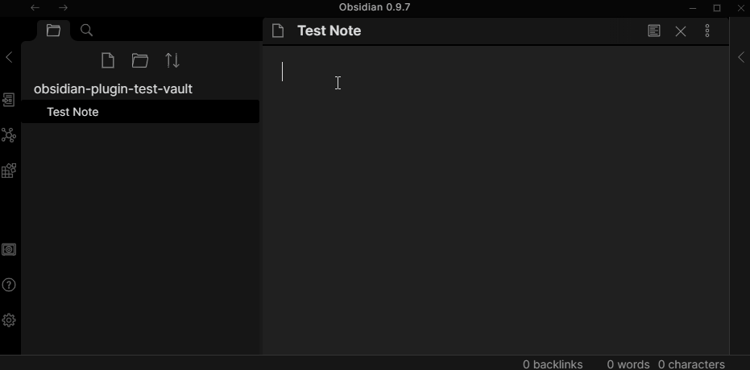

# Obsidian Table Editor Plugin

Add improved navigation, formatting, and manipulation to markdown tables in Obsidian.

If you use a non-monospaced font while editing, it is recommended that you
disable the "Pad cell width" setting under the plugin settings. See [this
forum post](https://forum.obsidian.md/t/monospace-font-in-the-editor/648/10)
for steps on switching your editor to a monospaced font.

Leverages the excellent [mte-kernel](https://github.com/susisu/mte-kernel) to do the heavy lifting.

**Note:** The Obsidian API is still in early alpha and this plugin may break at any time!

## How to use

When a cursor is in a markdown table...

| Hotkey                            | Action        |
| --------------------------------- | ------------- |
| <kbd>Tab</kbd>                    | Next Cell     |
| <kbd>Shift</kbd> + <kbd>Tab</kbd> | Previous Cell |
| <kbd>Enter</kbd>                  | Next Row      |

Or use the command palette:

- "Navigate to Next Cell"
- "Navigate to Previous Cell"
- "Navigate to Next Row"
- "Insert column before current"
- "Format table at the cursor"
- "Left align column"
- "Center align column"
- "Right align column"

You may also use "Next Cell" (<kbd>Tab</kbd>) past the last column on a row to create another column at the end. Use the command again after typing your content to finish adding the column. Watch the demo above for an example.

## Compatibility

Custom plugins are only available for Obsidian v0.9.7+.

The current API of this repo targets Obsidian **v0.9.7**.

## How to install the plugin

### From within Obsidian

From Obsidian v0.9.8, you can activate this plugin within Obsidian by doing the following:

- Open Settings > Third-party plugin
- Make sure Safe mode is **off**
- Click Browse community plugins
- Search for "Table Editor"
- Click Install
- Once installed, close the community plugins window and activate the newly installed plugin

#### Updates

You can follow the same procedure to update the plugin

### From GitHub

- Download the [Latest release](https://github.com/tgrosinger/table-editor-obsidian/releases/latest)
- Extract the `table-editor-obsidian` folder from the zip to your vault's plugins folder: `<vault>/.obsidian/plugins/`  
Note: On some machines the `.obsidian` folder may be hidden. On MacOS you should be able to press `Command+Shift+Dot` to show the folder in Finder.
- Reload Obsidian
- If prompted about Safe Mode, you can disable safe mode and enable the plugin.
Otherwise head to Settings, third-party plugins, make sure safe mode is off and
enable Table Editor from there.

(Thanks to @deathau for the borrowed installation instructions.)

## Notes

This is very experimental and may features from the library are not yet
implemented. It is possible that there are bugs which may delete data in the
current note. Please make backups!
